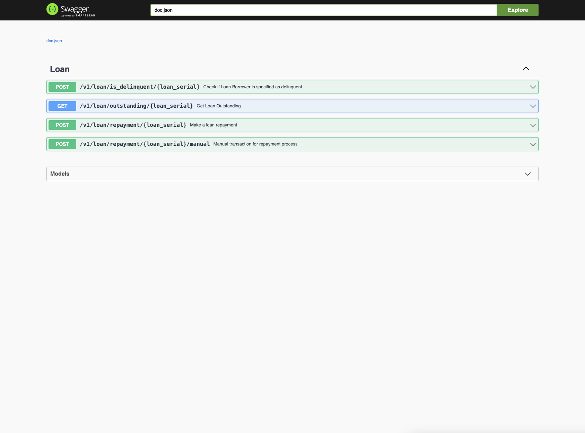

# Amartha Case Test 1 - Billing Engine

## Related Documents
- Test Document: [Amartha_Code_Test_Engineering.pdf](./docs/Amartha_Code_Test_Engineering.pdf)

## Installation
1. Run the database migration file located at `./migration/amartha_case_test.sql` on your PostgreSQL database. Ensure PostgreSQL is installed on your local or remote machine.
2. Install Redis on your local or remote machine.
3. Configure your database and Redis credentials in the `.env` file.

## Running the service
1. Navigate to the root directory of the service.
2. Run command 
  ```bash 
   go mod tidy && go mod vendor
   ```
4. Start the Service 
   ```bash 
   go run main.go
   ```
5. The service should now be up and running!

## Documentation
1. From the service root directory, generate Swagger docs by running:
   ```bash
   swag init
   ```
2. Restart the service (if it's already running): 
   ```bash
   go run main.go
   ```
3. In your browser, open this address [http://localhost:8080/swagger/index.html](http://localhost:8080/swagger/index.html)
4. If successful, you will find this swagger UI in your browser


## cURL Samples

1. **Make Repayment Endpoint (status: pending)**
   ```
    curl --location --request POST 'http://localhost:8080/v1/loan/repayment/62efb4bf-19d5-4070-9e61-bc182cee7850' \
    --header 'Content-Type: application/json' \
    --data-raw '{
      "date": "2025-08-08",
      "status": "pending"
    }'
   ```
   Note: 
   - If date is empty in payload body, default value will be current date
   - Default value for status is `pending`

2. **Make Repayment Endpoint (status: paid)**
   ```
    curl --location --request POST 'http://localhost:8080/v1/loan/repayment/62efb4bf-19d5-4070-9e61-bc182cee7850' \
    --header 'Content-Type: application/json' \
    --data-raw '{
      "date": "2025-08-08",
      "status": "paid"
    }'
   ```
   Note: 
   - If date is empty in payload body, default value will be current date
   - Default value for status is `pending`

3. **Is Delinquent Endpoint**
   ```
   curl --location --request POST 'http://localhost:8080/v1/loan/is_delinquent/62efb4bf-19d5-4070-9e61-bc182cee7850' \
    --header 'Content-Type: application/json' \
    --data-raw '{
      "max_date": "2025-07-20"
    }'
   ```
   Note: 
   - If max date is empty in payload body, default value will be current date

4. **Get Outstanding by Loan Serial Endpoint**
   ```
   curl --location --request GET 'http://localhost:8080/v1/loan/outstanding/62efb4bf-19d5-4070-9e61-bc182cee7850'
   ```