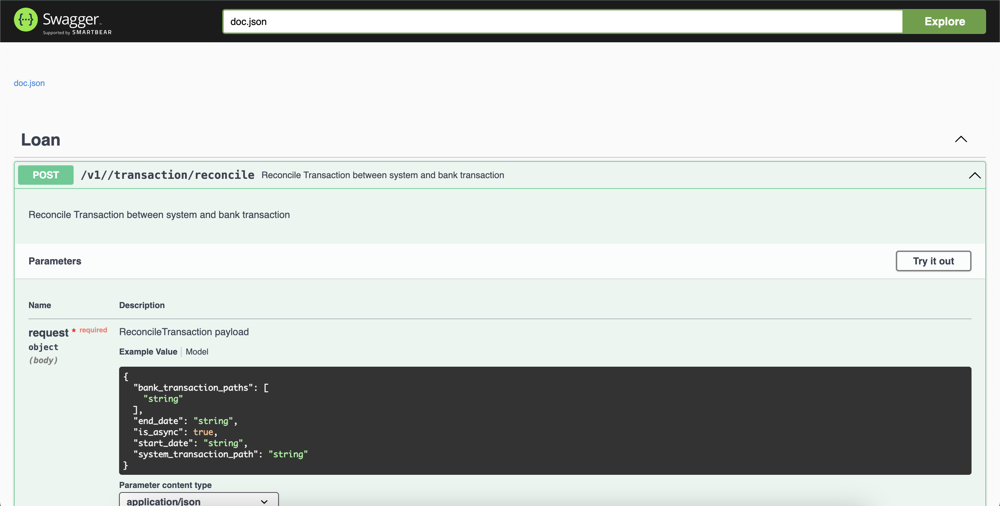

# Amartha Case Test 2 - Reconciliation Service

## Related Documents
- Test Document: [Amartha_Code_Test_Engineering.pdf](./docs/Amartha_Code_Test_Engineering.pdf)

## Installation
1. Install Redis on your local or remote machine.
2. Configure your Redis credentials in the `.env` file.

## Running the service
1. Navigate to the root directory of the service.
2. Run command 
  ```bash 
   go mod tidy && go mod vendor
   ```
4. Start the Service 
   ```bash 
   go run main.go
   ```
5. The service should now be up and running!

## Documentation
1. From the service root directory, generate Swagger docs by running:
   ```bash
   swag init
   ```
2. Restart the service (if it's already running): 
   ```bash
   go run main.go
   ```
3. In your browser, open this address [http://localhost:8080/swagger/index.html](http://localhost:8080/swagger/index.html)
4. If successful, you will find this swagger UI in your browser


## cURL Samples

1. **Reconsile Transaction**
   ```
   curl --location --request POST 'http://localhost:8080/v1/transaction/reconcile' \
   --header 'Content-Type: application/json' \
   --data-raw '{
   "bank_transaction_paths": [
      "./data/BCA.csv",
      "./data/BNI.csv",
      "./data/mandiri.csv"
   ],
   "is_async": true,
   "system_transaction_path": "./data/system_transaction.csv"
   }'
   ```
